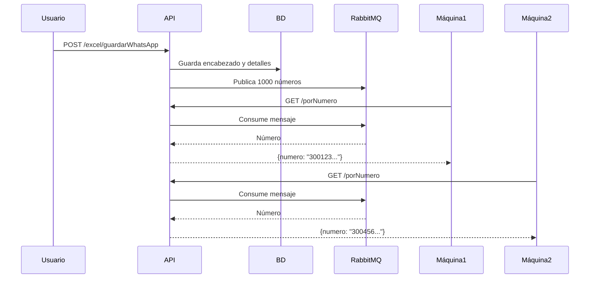

# Sistema de Cola de Números para WhatsApp

## 📋 Descripción

Este sistema implementa una cola distribuida usando RabbitMQ que permite que múltiples máquinas (15 en tu caso) consuman números de forma segura sin duplicados.

## 🔧 Cómo funciona

### 1. **Carga de Excel** (Automática)
Cuando subes un archivo Excel mediante el endpoint `/excel/guardarWhatsApp`:
- Los números se guardan en la base de datos
- **Automáticamente** se agregan a la cola de RabbitMQ
- Las máquinas pueden empezar a consumir inmediatamente

### 2. **Consumo de Números** (Máquinas Cliente)
Las 15 máquinas llaman al endpoint:
```
GET /automatizacionWhatsApp/porNumero
```

**Características:**
- ✅ Cada número solo es procesado por UNA máquina
- ✅ No hay duplicados (RabbitMQ garantiza entrega única)
- ✅ Si una máquina falla, el número NO se pierde (ACK automático)
- ✅ Timeout configurable (3 segundos por defecto)

**Respuesta exitosa (200):**
```json
{
  "idEncabezado": 123,
  "indicativo": "57",
  "numero": "3001234567"
}
```

**Sin números disponibles (404):**
```json
{
  "error": "No hay números disponibles en la cola"
}
```

## 📦 Configuración

### Variables de Entorno (`.env`)
```properties
# Cola de números disponibles
RABBIT_NUMEROS_QUEUE=whatsapp.numeros.disponibles
RABBIT_NUMEROS_TIMEOUT=3.0
```

### Ajustar timeout
Si las máquinas están muy distribuidas geográficamente, aumenta el timeout:
```properties
RABBIT_NUMEROS_TIMEOUT=5.0  # 5 segundos
```

## 🛠️ Scripts de Administración

### 1. Poblar Cola Manualmente (Si es necesario)
```powershell
# Poblar todos los números disponibles
cd D:\microservicios\WhatsApp\app
python poblar_cola_numeros.py

# Poblar solo números de un encabezado específico
python poblar_cola_numeros.py --encabezado 123
```

### 2. Verificar Estado de la Cola
Usa el panel de administración de RabbitMQ:
```
http://localhost:15672
```
- Usuario: `developmentit`
- Password: `Bogotacolombia2025+`

Ve a **Queues** → `whatsapp.numeros.disponibles` para ver:
- Cantidad de mensajes en cola
- Tasa de consumo
- Mensajes por segundo

## 🔄 Flujo Completo



## ⚠️ Importante

### ¿Qué pasa si una máquina falla?
- El número ya fue consumido de la cola (ACK enviado)
- Debes implementar un mecanismo de reintento en tu lógica de negocio
- O usar Dead Letter Queue (DLQ) para números que fallaron

### ¿Cómo sé cuándo terminó el proceso?
El endpoint existente `/notificarFinalizacionWhatsApp` sigue funcionando igual.

### ¿Puedo pausar el proceso?
Sí, los endpoints de pausa/reanudación siguen funcionando:
- `POST /pausar/{id_encabezado}`
- `POST /reanudar/{id_encabezado}`

## 🚀 Ventajas vs Sistema Anterior

| Característica | Sistema Anterior (BD) | Sistema Nuevo (Cola) |
|----------------|----------------------|----------------------|
| Duplicados | ⚠️ Posibles (race condition) | ✅ Imposibles |
| Carga en BD | 🔴 Alta (15 consultas/seg) | 🟢 Baja (solo escritura) |
| Escalabilidad | ⚠️ Limitada | ✅ Ilimitada |
| Velocidad | 🐢 Lenta (queries) | 🚀 Rápida (memoria) |
| Recuperación | ⚠️ Compleja | ✅ Automática |

## 📞 Soporte

Si tienes problemas:
1. Verifica que RabbitMQ esté corriendo
2. Revisa los logs del API
3. Verifica la cola en el panel de RabbitMQ
4. Ejecuta el script de población manual si es necesario
